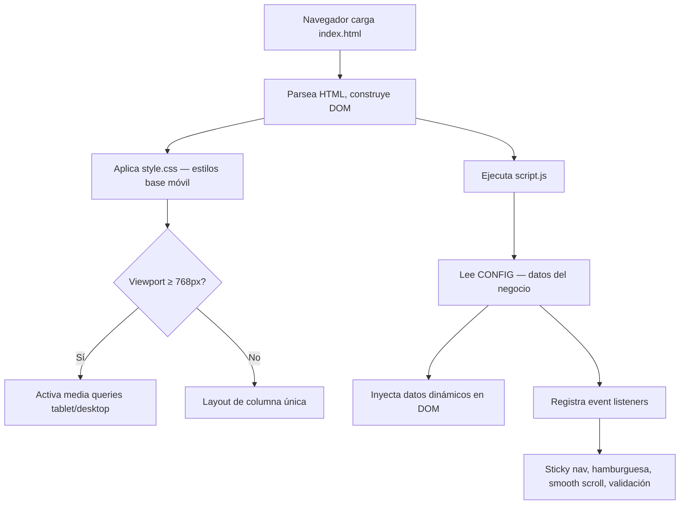

# Design Document: Librería y Bazar Roca Eterna — Landing Page

## Overview

La landing page de **Librería y Bazar Roca Eterna** es un sitio estático de una sola página construido con HTML5, CSS3 y JavaScript puro (vanilla JS), sin frameworks ni dependencias externas de runtime. El objetivo es ofrecer una presencia digital sencilla, rápida y mantenible por alguien con conocimientos básicos de web.

La arquitectura sigue un enfoque **mobile-first**: los estilos base apuntan a pantallas de 320 px y se expanden progresivamente con media queries en 768 px (tablets / nav sticky) y 992 px (escritorio / layout de dos columnas). Los datos del negocio se centralizan en `script.js` para facilitar actualizaciones sin tocar HTML ni CSS.

---

## Architecture

### Principios de diseño

- **Sin dependencias de red en runtime**: No hay llamadas a CDN de JavaScript, frameworks ni APIs externas obligatorias (la única dependencia opcional externa son las fuentes de Google Fonts, con fallback a system fonts).
- **Archivos mínimos**: Tres archivos de código (`index.html`, `style.css`, `script.js`) más un `README.md`.
- **Datos centralizados**: Todo dato modificable (teléfono, dirección, horario, WhatsApp, redes sociales) vive en un objeto `CONFIG` al inicio de `script.js`.
- **Separación de responsabilidades**: HTML = estructura semántica, CSS = presentación visual, JS = comportamiento e interactividad.

### Diagrama de archivos

```
Proyecto Landing Page LBRE/
├── index.html          # Estructura semántica de la página
├── style.css           # Estilos mobile-first + variables CSS
├── script.js           # Configuración centralizada + comportamiento
└── README.md           # Instrucciones de mantenimiento en español
```

### Flujo de carga



---

## Components and Interfaces

### Estructura semántica HTML5

```
<body>
  <header id="header">                  ← sticky en ≥768px
    <nav id="main-nav">
      <a class="logo">…</a>
      <button class="hamburger">…</button>
      <ul class="nav-links">…</ul>
    </nav>
  </header>

  <main>
    <section id="inicio">               ← Hero Section (100vh)
    <section id="categorias">           ← Product Cards grid
    <section id="nosotros">             ← Historia + horario + dirección
    <section id="contacto">             ← Formulario + info de contacto
  </main>

  <footer id="footer">                  ← Copyright + redes + nav rápida
  </footer>

  <a id="whatsapp-btn" …>               ← Botón flotante WhatsApp (fuera del flujo)
  </a>
</body>
```

### Componentes detallados

#### 1. Header / Navigation

| Elemento | Rol semántico | Notas |
|---|---|---|
| `<header>` | Cabecera del documento | `position: sticky; top: 0` activado por JS en scroll > 80 px (≥768 px) |
| `<nav>` | Navegación principal | `aria-label="Navegación principal"` |
| `.logo` | Enlace al inicio | Texto del negocio o imagen con `alt` |
| `.hamburger` | `<button>` | `aria-expanded`, `aria-controls` para accesibilidad; visible solo en <768 px |
| `.nav-links` | `<ul>` con `<li><a>` | Colapsado en móvil vía clase `open`; `smooth-scroll` via JS |

**Comportamiento sticky (JS)**:

```
scroll event → if scrollY > 80px && viewport >= 768px → header.classList.add('sticky')
                                                        else → header.classList.remove('sticky')
```

#### 2. Hero Section

| Elemento | Notas |
|---|---|
| `<section id="inicio">` | `min-height: 100vh` |
| `<h1>` | "Librería y Bazar Roca Eterna" |
| `<p class="hero-slogan">` | Eslogan del negocio |
| `<a class="cta-button" href="#categorias">` | Smooth scroll hacia `#categorias` |

**Decisión de diseño**: Se usa `min-height: 100vh` en lugar de `height: 100vh` para que el contenido no quede cortado en pantallas muy pequeñas.

#### 3. Sección Categorías

```html
<section id="categorias">
  <h2>Nuestras Categorías</h2>
  <div class="cards-grid">
    <!-- Repetir 4 veces -->
    <article class="product-card">
      <div class="card-icon"><!-- SVG o emoji --></div>
      <h3 class="card-title">Nombre Categoría</h3>
      <p class="card-desc">Descripción ≤20 palabras</p>
    </article>
  </div>
</section>
```

Grid CSS:
- Móvil (<768 px): 1 columna
- Tablet (≥768 px): 2 columnas (`grid-template-columns: repeat(2, 1fr)`)
- Desktop (≥992 px): 4 columnas (`grid-template-columns: repeat(4, 1fr)`)

**Hover effect**: `transform: translateY(-6px); box-shadow: 0 8px 24px rgba(0,0,0,0.12);` con `transition: 0.25s ease`.

#### 4. Sección Nosotros

```html
<section id="nosotros">
  <div class="nosotros-grid">
    <div class="nosotros-text">
      <h2>Nosotros</h2>
      <p><!-- Historia / misión --></p>
    </div>
    <div class="nosotros-info">
      <h3>Horario</h3>
      <p><!-- Horario de atención --></p>
      <h3>Dirección</h3>
      <address><!-- Dirección física --></address>
    </div>
  </div>
</section>
```

Layout:
- Móvil: columna única
- Desktop (≥992 px): `grid-template-columns: 1fr 1fr`

#### 5. Sección Contacto

```html
<section id="contacto">
  <div class="contacto-grid">
    <form id="contact-form" novalidate>
      <div class="form-group">
        <label for="nombre">Nombre *</label>
        <input type="text" id="nombre" name="nombre" required>
        <span class="error-msg" role="alert"></span>
      </div>
      <div class="form-group">
        <label for="telefono">Teléfono</label>
        <input type="tel" id="telefono" name="telefono">
      </div>
      <div class="form-group">
        <label for="mensaje">Mensaje *</label>
        <textarea id="mensaje" name="mensaje" required></textarea>
        <span class="error-msg" role="alert"></span>
      </div>
      <button type="submit">Enviar mensaje</button>
      <div id="form-confirmation" role="status" aria-live="polite"></div>
    </form>

    <div class="contacto-info">
      <h3>Información de contacto</h3>
      <p><a href="tel:+XXXXXXXXXX">+XX XXXX-XXXX</a></p>
      <p><a href="mailto:correo@ejemplo.com">correo@ejemplo.com</a></p>
      <address><!-- Dirección --></address>
    </div>
  </div>
</section>
```

**Validación JS**: El atributo `novalidate` desactiva la validación nativa del navegador para usar mensajes de error personalizados. El handler `submit` valida campos requeridos y muestra/oculta `.error-msg` con los mensajes descriptivos.

#### 6. Footer

```html
<footer id="footer">
  <div class="footer-content">
    <p class="footer-brand">Librería y Bazar Roca Eterna</p>
    <p class="footer-copy">© <span id="footer-year"></span></p>
    <nav class="footer-nav" aria-label="Navegación del pie de página">
      <ul><!-- Inicio, Categorías, Nosotros, Contacto --></ul>
    </nav>
    <div class="footer-social">
      <a href="…" target="_blank" rel="noopener noreferrer" aria-label="Facebook"><!-- icono --></a>
      <a href="…" target="_blank" rel="noopener noreferrer" aria-label="Instagram"><!-- icono --></a>
    </div>
  </div>
</footer>
```

`<span id="footer-year">` se rellena dinámicamente con `new Date().getFullYear()` en `script.js`.

#### 7. Botón flotante de WhatsApp

```html
<a id="whatsapp-btn"
   href="https://wa.me/XXXXXXXXXX?text=…"
   target="_blank"
   rel="noopener noreferrer"
   aria-label="Contactar por WhatsApp">
  <!-- Icono SVG de WhatsApp -->
</a>
```

```css
#whatsapp-btn {
  position: fixed;
  bottom: 24px;
  right: 24px;
  z-index: 9999;
  width: 56px;
  height: 56px;
  border-radius: 50%;
  background: #25D366;
  display: flex;
  align-items: center;
  justify-content: center;
  box-shadow: 0 4px 16px rgba(0,0,0,0.25);
}
```

La URL y el mensaje se construyen en `script.js` a partir de `CONFIG.whatsapp`.

---

## Data Models

### Objeto de configuración centralizada (`script.js`)

```javascript
/**
 * CONFIGURACIÓN DEL NEGOCIO
 * Edita solo este objeto para actualizar los datos de contacto y contenido.
 */
const CONFIG = {
  negocio: {
    nombre: "Librería y Bazar Roca Eterna",
    eslogan: "Todo lo que necesitás, en un solo lugar",
    descripcion: "Negocio familiar con amplia variedad de productos...",
  },
  contacto: {
    telefono: "+54 XXX XXX-XXXX",       // formato: +código_país número
    telefonoHref: "+54XXXXXXXXXX",       // sin espacios, para href="tel:"
    email: "rocaeterna@ejemplo.com",
    direccion: "Calle Ejemplo 123, Ciudad, Provincia",
    horario: "Lun a Sáb: 9:00–13:00 / 17:00–21:00",
  },
  whatsapp: {
    numero: "54XXXXXXXXXX",             // sin "+" ni espacios
    mensaje: "Hola, me comunico desde la web. Quisiera consultar...",
  },
  redes: {
    facebook: "https://facebook.com/rocaeterna",
    instagram: "https://instagram.com/rocaeterna",
  },
  categorias: [
    {
      id: "libreria",
      nombre: "Librería y Papelería",
      descripcion: "Cuadernos, útiles escolares y artículos de oficina.",
      icono: "📚",                       // emoji como fallback; reemplazable por SVG
    },
    {
      id: "electronica",
      nombre: "Electrónica",
      descripcion: "Accesorios, cables, pilas y gadgets del hogar.",
      icono: "🔌",
    },
    {
      id: "belleza",
      nombre: "Belleza y Cuidado Personal",
      descripcion: "Cosméticos, higiene y productos de cuidado diario.",
      icono: "💄",
    },
    {
      id: "tienda",
      nombre: "Tienda General",
      descripcion: "Artículos del hogar, limpieza y mucho más.",
      icono: "🛒",
    },
  ],
};
```

### Modelo de error de formulario

```javascript
// Estado interno del formulario — no persistido
const formState = {
  nombre:  { value: "", valid: false, errorMsg: "El nombre es requerido." },
  mensaje: { value: "", valid: false, errorMsg: "El mensaje es requerido." },
};
```

---

## Correctness Properties

*Una propiedad es una característica o comportamiento que debe mantenerse verdadera en todas las ejecuciones válidas del sistema — esencialmente, un enunciado formal sobre qué debe hacer el sistema. Las propiedades sirven como puente entre las especificaciones legibles por humanos y las garantías de corrección verificables por máquina.*

### Evaluación de aplicabilidad de PBT

Esta feature es una **landing page estática** con HTML/CSS/JS puro. La mayoría de las funciones son transformaciones de datos en memoria (generación de URLs, validación de formulario, construcción de HTML, formateo de texto). Existe un subconjunto de lógica pura (validación de campos, construcción de URL de WhatsApp, renderizado de tarjetas de categorías, inyección dinámica de datos) que **es apto para property-based testing** en JavaScript usando una librería como [fast-check](https://github.com/dubzzz/fast-check).

Las secciones de layout/responsive y comportamiento visual (sticky nav, hover cards) **no son aptas para PBT** y se validan con pruebas de ejemplo/integración.

---

### Property 1: Validación de campos requeridos

*Para cualquier* valor de entrada del campo "nombre" o del campo "mensaje" que sea una cadena compuesta únicamente de espacios en blanco (incluyendo cadena vacía), el Contact_Form SHALL rechazar el envío y mostrar un mensaje de error no vacío en el campo correspondiente.

**Validates: Requirements 5.2**

---

### Property 2: URL de WhatsApp construida correctamente

*Para cualquier* número de teléfono válido y mensaje de texto arbitrario (sin caracteres de control) almacenados en `CONFIG.whatsapp`, la URL generada para el WhatsApp_Button SHALL tener el formato `https://wa.me/{numero}?text={mensaje_codificado}` y ser una URL válidamente codificada (encodeURIComponent aplicado al texto).

**Validates: Requirements 6.3**

---

### Property 3: Renderizado completo de tarjetas de categorías

*Para cualquier* arreglo de categorías con al menos un elemento (donde cada elemento tiene los campos `nombre`, `descripcion` e `icono`), el renderizado de las Product_Cards SHALL producir exactamente tantos elementos `.product-card` en el DOM como ítems en el arreglo, y cada tarjeta SHALL contener el nombre y la descripción del ítem correspondiente.

**Validates: Requirements 3.1, 3.2**

---

### Property 4: Inyección de datos del negocio es idempotente

*Para cualquier* objeto CONFIG válido, aplicar la función de inyección de datos en el DOM dos veces consecutivas SHALL producir el mismo resultado observable en el DOM que aplicarla una sola vez (ningún dato se duplica).

**Validates: Requirements 9.3**

---

### Property 5: Año del footer siempre es el año actual

*Para cualquier* momento en que se cargue la página, el contenido del elemento `#footer-year` SHALL ser igual a `String(new Date().getFullYear())` en el momento de la ejecución.

**Validates: Requirements 10.1**

---

## Error Handling

### Formulario de contacto

| Situación | Comportamiento esperado |
|---|---|
| Campo requerido vacío al enviar | Se muestra `.error-msg` con texto descriptivo; no se envía el formulario; el foco se mueve al primer campo inválido |
| Todos los campos requeridos completos | Se muestra `#form-confirmation` con mensaje de éxito; los campos se limpian |
| JavaScript deshabilitado | El formulario funciona con validación nativa del navegador (sin `novalidate`; se agrega por JS) |

### Botón de WhatsApp

| Situación | Comportamiento esperado |
|---|---|
| Número no configurado en CONFIG | Se oculta el botón para no generar URLs inválidas |
| Dispositivo sin WhatsApp instalado | El enlace abre `web.whatsapp.com` en el navegador (comportamiento nativo de `wa.me`) |

### Navegación / Smooth Scroll

| Situación | Comportamiento esperado |
|---|---|
| `scrollBehavior` no soportado | Fallback: el enlace ancla navega directamente sin animación (comportamiento nativo del navegador) |
| ID de sección no existe en DOM | El enlace no produce scroll; no se lanza error de JS (se verifica con `document.querySelector` antes de llamar `scrollIntoView`) |

---

## Testing Strategy

### Evaluación general

Esta landing page estática tiene lógica de negocio acotada pero bien definida. Se aplica una estrategia de **pruebas duales**:

1. **Unit tests / Example tests**: verifican comportamientos concretos y casos borde.
2. **Property-based tests**: verifican propiedades universales de las funciones puras (validación, URL building, renderizado de tarjetas, inyección de datos).

### Herramienta sugerida

- **[fast-check](https://github.com/dubzzz/fast-check)** (JavaScript) para property-based tests.
- **[Vitest](https://vitest.dev/)** o **Jest** como runner de tests. Dado que el proyecto es vanilla JS sin bundler, se puede usar Vitest con modo `globals: true` y transformar los módulos ES sin configuración extra.

### Unit tests (ejemplo-based)

| Test | Caso | Validates |
|---|---|---|
| Validación formulario | Campo nombre = "" → error presente | Req 5.2 |
| Validación formulario | Campo nombre = "   " → error presente | Req 5.2 |
| Validación formulario | Nombre y mensaje completos → sin error | Req 5.2 |
| URL WhatsApp | numero="541234", msg="hola" → URL correcta | Req 6.3 |
| Footer year | Retorna año actual como string | Req 10.1 |
| Cards renderizadas | 4 categorías → 4 `.product-card` en DOM | Req 3.1 |

### Property-based tests (fast-check)

Cada test debe ejecutar mínimo 100 iteraciones.

| Property | Tag de referencia | Validates |
|---|---|---|
| Property 1: Validación de campos requeridos | `Feature: rocaterno-landing-page, Property 1: Validación de campos requeridos` | Req 5.2 |
| Property 2: URL de WhatsApp construida correctamente | `Feature: rocaterno-landing-page, Property 2: URL de WhatsApp construida correctamente` | Req 6.3 |
| Property 3: Renderizado completo de tarjetas | `Feature: rocaterno-landing-page, Property 3: Renderizado completo de tarjetas de categorías` | Req 3.1, 3.2 |
| Property 4: Inyección de datos es idempotente | `Feature: rocaterno-landing-page, Property 4: Inyección de datos del negocio es idempotente` | Req 9.3 |
| Property 5: Año del footer | `Feature: rocaterno-landing-page, Property 5: Año del footer siempre es el año actual` | Req 10.1 |

### Pruebas que NO aplican para PBT

| Aspecto | Estrategia alternativa |
|---|---|
| Layout responsive / breakpoints | Prueba visual manual / screenshot testing con Playwright |
| Comportamiento sticky nav | Test de integración con jsdom o Playwright |
| Efecto hover en tarjetas | Prueba visual manual |
| Accesibilidad (contraste, foco) | Revisión manual + axe-core (herramienta de auditoría) |
| SEO meta tags | Revisión manual del HTML generado |

---

## Visual Design Decisions

### Paleta de colores

| Variable CSS | Valor | Uso |
|---|---|---|
| `--color-primary` | `#2C5F8A` | Azul profundo — nav, botones primarios, acentos |
| `--color-primary-dark` | `#1E4266` | Hover de botones primarios |
| `--color-secondary` | `#E8A020` | Ámbar dorado — acentos, CTA, hover cards |
| `--color-secondary-dark` | `#C8881A` | Hover del CTA |
| `--color-bg` | `#F8F5F0` | Fondo general — blanco cálido |
| `--color-surface` | `#FFFFFF` | Fondo de tarjetas y formulario |
| `--color-text` | `#1A1A2E` | Texto principal (contraste ≥ 4.5:1 sobre fondo) |
| `--color-text-muted` | `#5A5A72` | Texto secundario / descriptivo |
| `--color-border` | `#D9D3C8` | Bordes y separadores |
| `--color-whatsapp` | `#25D366` | Botón flotante WhatsApp |
| `--color-error` | `#C0392B` | Mensajes de error del formulario |
| `--color-success` | `#27AE60` | Mensaje de confirmación del formulario |

**Rationale**: El azul profundo transmite confianza y seriedad (apropiado para un negocio familiar), mientras que el ámbar dorado agrega calidez y atrae la atención hacia las llamadas a la acción. El fondo blanco cálido evita la frialdad de un blanco puro.

### Tipografía

```css
/* Variables tipográficas */
--font-base: 'Inter', system-ui, -apple-system, sans-serif;
--font-heading: 'Playfair Display', Georgia, serif;
--font-size-base: 16px;
--font-size-sm: 14px;
--font-size-lg: 18px;
--font-size-xl: 24px;
--font-size-2xl: 32px;
--font-size-3xl: 48px;
--line-height-base: 1.6;
--line-height-heading: 1.2;
```

- **Inter** (Google Fonts): Sans-serif moderno, excelente legibilidad en pantalla, muy liviano.
- **Playfair Display** (Google Fonts): Serif elegante para títulos, da personalidad al negocio.
- **Fallback**: `system-ui, -apple-system, sans-serif` / `Georgia, serif` — la página es funcional sin conexión a Google Fonts.

**Carga de fuentes**: `<link rel="preconnect">` + `<link rel="stylesheet">` en el `<head>` de `index.html`, con atributo `font-display: swap` para evitar FOIT (flash of invisible text).

### Espaciado

```css
--spacing-xs:  4px;
--spacing-sm:  8px;
--spacing-md:  16px;
--spacing-lg:  24px;
--spacing-xl:  48px;
--spacing-2xl: 80px;
--container-max: 1200px;
--section-padding: clamp(40px, 8vw, 80px);
```

### Iconos

- **Estrategia principal**: SVG inline para los iconos del Footer (Facebook, Instagram) y el botón de WhatsApp — sin peticiones de red adicionales, escalables y estilizables con CSS.
- **Estrategia fallback para tarjetas de categorías**: Emoji Unicode (`📚`, `🔌`, `💄`, `🛒`) como valor por defecto en `CONFIG.categorias[].icono`; el mantenedor puede reemplazarlos por SVGs inline en el mismo campo.

### Breakpoints y estrategia responsive

```css
/* Mobile-first: base = 320px */

/* Tablet */
@media (min-width: 768px) {
  /* Nav sticky, cards 2 columnas, hero text más grande */
}

/* Desktop */
@media (min-width: 992px) {
  /* Nosotros 2 columnas, cards 4 columnas, container limitado a 1200px */
}
```

### JavaScript — Comportamientos implementados

| Comportamiento | Estrategia de implementación |
|---|---|
| Sticky nav | `scroll` event listener; toggle clase `.sticky` en `<header>` cuando `scrollY > 80` y `innerWidth >= 768` |
| Menú hamburguesa | `click` en `.hamburger`; toggle clase `.open` en `.nav-links`; actualiza `aria-expanded` |
| Cerrar menú al navegar | `click` en cada `<a>` de `.nav-links` remueve clase `.open`; útil en móvil |
| Smooth scroll | `click` en cualquier enlace ancla (`href="#…"`); `document.querySelector(target).scrollIntoView({ behavior: 'smooth' })` |
| Validación de formulario | Handler `submit` con `preventDefault()`; verifica `.trim().length > 0` en campos requeridos; inyecta mensajes de error descriptivos |
| Mensaje de confirmación | Tras validación exitosa: inyecta texto en `#form-confirmation`, limpia campos, hace scroll al mensaje |
| Construcción URL WhatsApp | Usa `CONFIG.whatsapp.numero` y `encodeURIComponent(CONFIG.whatsapp.mensaje)` |
| Año del footer | `document.getElementById('footer-year').textContent = new Date().getFullYear()` |
| Inyección de datos CONFIG | Función `initPage()` llamada al cargar el DOM (`DOMContentLoaded`); recorre el DOM e inyecta valores de `CONFIG` |
